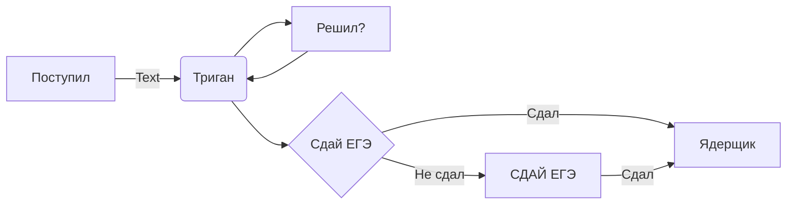
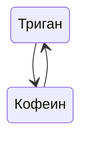

## GUIDE

PROCEED: ./projects/ABOUT.md

 - /gamemode 1 [^1]

[^1]: Unknown command /gamemode creative <-- *[HERE]*

```mermaid
flowchart LR

A[Поступил] -->|Text| B(Триган)
B --> Решил?
Решил? --> B
B --> C{Сдай ЕГЭ}
C -->|Сдал| D[Ядерщик]
C -->|Не сдал| E[СДАЙ ЕГЭ]
E -->|Сдал| D
```

```mermaid
stateDiagram-v2
Триган --> Кофеин
Кофеин --> Триган
```
