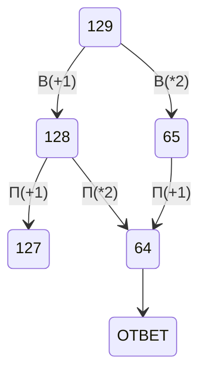
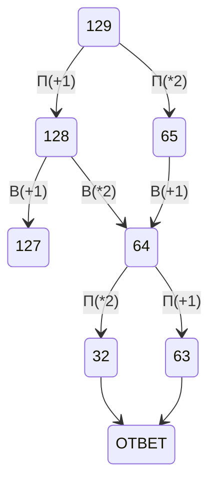
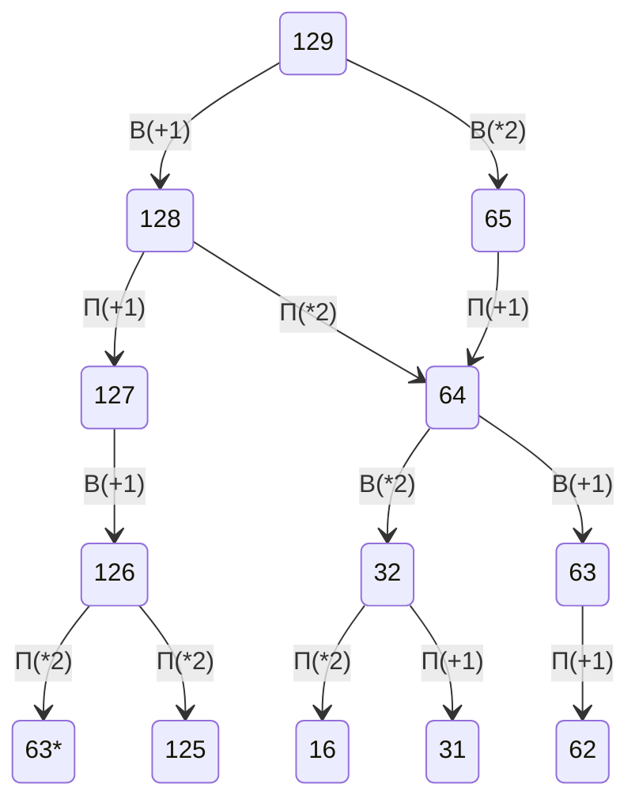

# 1 Задача
1) определить точки, из которых выходят 3 линии
2) поподставять эти точки и , определить длины линий между ними и увидеть точки соединённые двумя дорогами.
3) поподставять и потом посчитать ответ
# 2 Задача 
1) Получить все возможные варианты 4-ёх переменных
2) берем if и выводим x,y,z,w в разном порядке
# 3 Задача 
1) используем фильтр (раздел данных)
2) далее используем мозг и считаем ответ (иногда нужно скопировать таблицу по значениям и использовать функции)
# 4 Задача 
1) расписать 2-ичное древо
2) внести известные данные
3) Соотнести количество вариантов с количеством символов, начиная с минимального кода. 
# 5 Задача
1) Получение конечного числа в двоичной системе форматированием bin(i)[2:]
2) Проверка на четность бита и подстановка
3) перевод числа в 10 чную систему
# 6 Задача
1) Вспомнить команды черепахи
2) оранизовать алгортм задачи
3) рисуем точки из начала координат с помощью goto()
4) считаем точки
# 7 Задача
1) Испольуем формулу V=M*i*t для звука
t - время
i - раширение
m - частота дискретезации
v - объем файла в битах
# 8 Задача
1) Создание всех чисел искомой системы счисления
2) Проверяем, есть ли последовательность выполнения условия
3) Вывод счетчика искомых значений 
# 9 Задача
1) засунусть в питон
2) разбить на строки
3) делать всякие махинации с 1 строкой на то подходит ли она
# 10 Задача
1) открыть файл, нажать "Ctrl + f"
2) выбрать параметры поиска: "учитывать регист" и "Только слово целиком"
# 13 Задача 
1) старт маркеруется 1
2) анализируем пункты, в которые можно попасть по 1 дороге
3) позже большие, но строго следовать маршруту 
# 14 Задача
1) по возможноости преобразовать последовательность в уравнение
2) организовать подбор параметров для нахождения ответа
3) Обращать внимание на количество замен (replace('old','new',count)
# 18 Задача
1) левый верхний угол берём значение из 1 таблицы
2) в ячейке справа складываем значение этой ячейки из таблицы 1 и значения 1 ячейки, аналогично для ячейки снизу
3) далее используем макс()+зн этой ячейки из таблицы 1 (макс() для ячеек сверху с снизу относительно даной)
4) за барьерами используем формулы сложения верхнего и данного значения , аналогично для горизонтального.
# 19 Задача
1) нарисовать двоичное дерево, начиная с победных ходов
2) расписываем дерево на 4 хода
3) считаем по усл задачи где чей ход
extra (обычно ответ это число, которое можно получить только 1 способом)

# 20 Задача

# 21 Задача

# 23 Задача
1)С помощью функции product (from itertools import product) образовать объект со всеми комбинациями искомой строки
2)делаем из продукта список
3)перебор программ в совокупности программ
4)стартовое значение приводим в начальное значение
5)использует Continue для пропуска итераций неподходящих прог
6)заходим в прогу и анализируем команды
# 26 
1) Открыть файлв кальке / экселе
2) добавили фильтр по убыванию на первый столбец
3) =ЕСЛИ(A1-A2=0;0;A1) избавление от дубликатов чисел
4) избавление от формулы, путем вставки,как число результата п.3
5) отсортировать по убыванию, отключить ноль
6) рядом с 2 значением считаем дельту 1 и 2 значения
7) накапливаем дельту с условием =>3
8) считаем 0 с помощью =СЧЁТЕСЛИ , +1
# 27 (a)
1) Загрузить данные с файла, удалить 1 элемент !
2) создать переменную по длинне списка
3) удвоить список и позже использовать срез 
4) в цикле создаем список на основе сдвоенного
5) обнуляем стоиомть при каждом новом списке
6) считаем стоимость для 1 элемента по формуле
7) смещая срез находим стоимость всех пунктов
8) длины после середины дороги убывают, для подсчёта новой длины нужна новая переменная
9) стоимости накапливатся в списке 
10) в качестве ответа выдаётся индекс минимального элемента списка, потом +1
# 27 (b)
1) организуем перебор списка по диапозону, в аргументах которого есть старт , финиш и шаг
2) используем замер выборочных километров (равно распределенных)
3) организуются глобальный цикл с измененинием старта, фишиниша и шага
4) после каждой итерации уменьшаем их
5) выход из глобального цикла при повторении ответа 2 раза при шаге 1
6) если шаг=0, то шаг устанавливается 1
7) целисообразно а каждом проходе ставить новый старт, финиш и шаг
8) границы диапозона стар финиш шаг определяются минимальным километражём +- шаг.
9) после перечёта старта и финиша пересчитываем шаг
10) целе сообразно брать 20 замеров на диапозон
